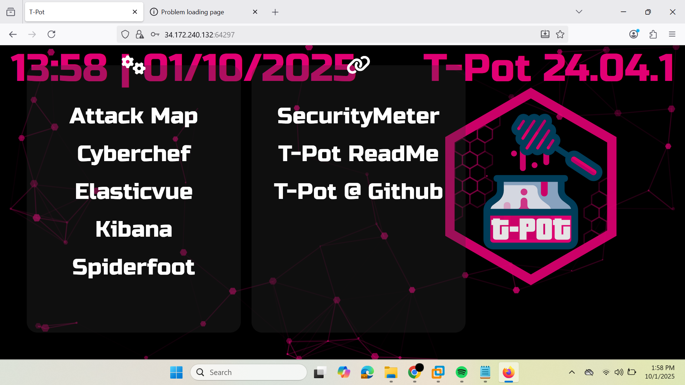
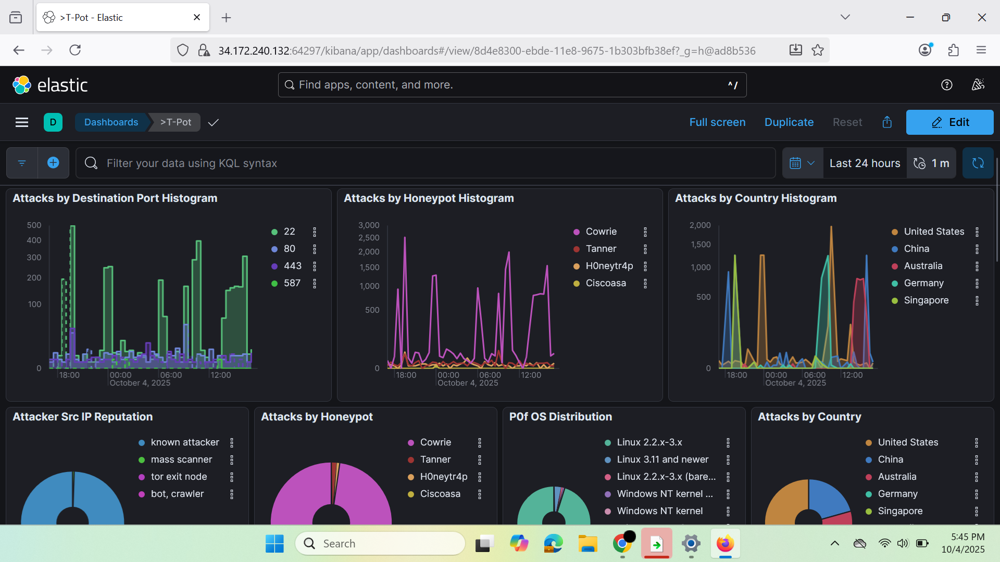
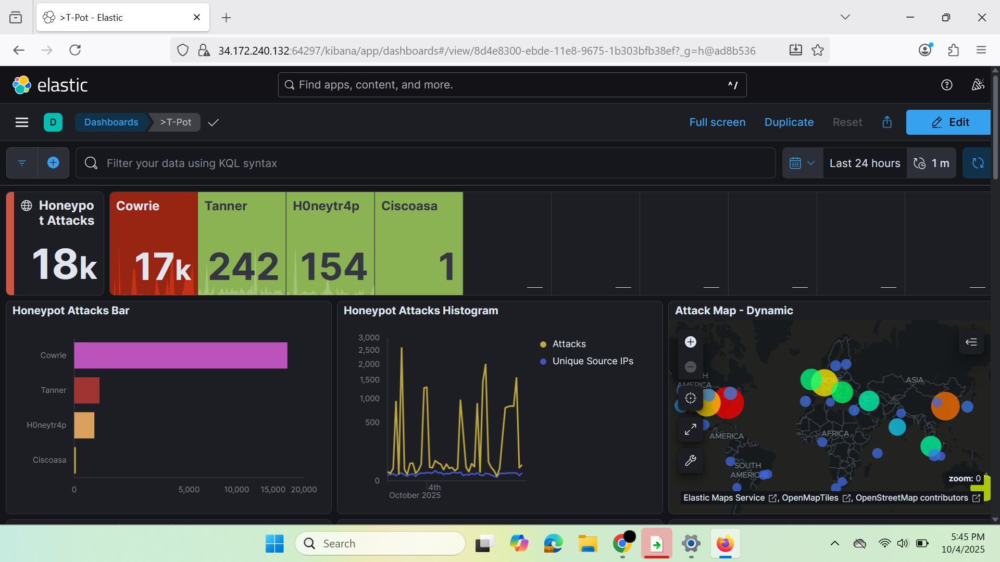

# T-Pot Honeypot Deployment — Google Cloud (GCP)

**Project Owner:** Nishanth Butta
**Date:** October 1, 2025
**Stack:** T-Pot (telekom-security/tpotce) · Cowrie · Elastic Stack · Ubuntu 24.04 · Google Cloud Platform

---

# Summary

This project documents the deployment of a **T-Pot honeypot on Google Cloud** to capture and analyze opportunistic internet attacks.

The honeypot environment was deployed inside an isolated cloud network where exposed services intentionally attract malicious traffic. Attack telemetry was collected and visualized using the **Elastic Stack (ELK)** dashboards included with the T-Pot platform.

This repository includes sanitized setup steps, screenshots of attack telemetry, and documentation describing observed attack patterns.

---

# Dashboard Preview

The T-Pot honeypot platform provides a centralized monitoring interface built on the Elastic Stack (ELK).
Below is the main landing dashboard used to monitor honeypot activity.



---

# What I Accomplished

• Deployed a **T-Pot honeypot (Hive profile)** on Ubuntu 24.04 in Google Cloud
• Configured firewall rules and network isolation to safely expose honeypot services
• Captured live attacker telemetry including SSH brute force attempts, HTTP scans, and SMB probes
• Visualized attack activity using the Elastic Stack dashboards
• Documented the deployment process and created reproducible project documentation

---

# Architecture & Environment

**Cloud Provider:** Google Cloud Platform (GCP)
**Virtual Machine:** Ubuntu 24.04 LTS, 4 vCPU, 16 GB RAM, 200 GB SSD
**Network:** Dedicated subnet with network tag `tpot`
**Honeypot Platform:** T-Pot (telekom-security/tpotce)
**Deployment Date:** October 1, 2025

*Architecture diagram:* `docs/architecture-diagram.png` *(to be added)*

---

# Credential Attack Evidence

The honeypot captured repeated brute-force login attempts targeting commonly used usernames and passwords.
This behavior is typical of automated bots scanning the internet for exposed SSH services.



Common usernames targeted by attackers included:

* root
* admin
* ubuntu
* user

These login attempts were observed across multiple source IP addresses and geographic regions, indicating automated scanning activity.

---

# Global Attack Sources

The honeypot observed incoming connections from multiple geographic regions, demonstrating the global nature of automated attack traffic.



---

# Attack Monitoring

After deployment, the honeypot immediately began receiving automated attack traffic from the internet.

The Elastic Stack dashboards provided visibility into attacker behavior and credential attempts, helping identify patterns of automated scanning and brute-force activity.

These dashboards enable defenders to quickly visualize:

• login attempts
• credential usage patterns
• attacker source locations
• command activity

---

# Threat Intelligence Observations

Analysis of the honeypot telemetry revealed several patterns consistent with automated internet scanning and credential harvesting activity.

## Automated Brute Force Behavior

The majority of authentication attempts targeted default or commonly used system accounts.
This behavior is characteristic of automated botnets scanning for exposed SSH services.

Commonly targeted usernames included:

* root
* admin
* ubuntu
* user

These usernames are frequently used in automated credential-stuffing attacks.

## Opportunistic Internet Scanning

Attack traffic originated from multiple geographic regions and appeared to be automated scanning rather than targeted attacks.

This pattern is typical of internet-wide botnet scanning and vulnerability probing.

## Weak Credential Exploitation Attempts

The honeypot captured repeated attempts using commonly known weak passwords.
This demonstrates how attackers rely on credential dictionaries to compromise poorly secured systems.

---

# Security Implications

The results demonstrate how quickly publicly exposed infrastructure begins receiving malicious traffic. Even newly deployed servers are rapidly discovered by automated scanning systems across the internet.

These observations reinforce several security best practices:

• Disable password-based authentication where possible
• Restrict external access to administrative services
• Implement intrusion detection and logging systems
• Monitor network telemetry for anomalous behavior

---

# Skills Demonstrated

• Cloud infrastructure deployment using **Google Cloud Platform**
• Honeypot deployment and monitoring using **T-Pot**
• Threat telemetry analysis using the **Elastic Stack (ELK)**
• Network security monitoring and attack observation
• Docker-based security infrastructure
• Security documentation and reproducible deployment practices

---

# Quick Status

**T-Pot Dashboard:** [Redacted for security]
*(Self-signed certificate — browser security warning expected)*

**Logs:** Indexed in Elastic and accessible via Kibana dashboards

**PCAP Storage:** `/home/<user>/artifacts/pcap/` *(rotated and archived)*

---

# How to Reproduce (Sanitized)

Detailed setup instructions are available in `docs/install_steps.md`.

Key commands used during deployment:

```bash
# Clone and run the installer as a non-root user
git clone https://github.com/telekom-security/tpotce.git /home/tpotce
cd /home/tpotce
bash install.sh 2>&1 | tee ~/tpot-install.log
sudo reboot

# Verify containers are running
sudo docker ps --format "table {{.Names}}\t{{.Status}}\t{{.Ports}}"
```
